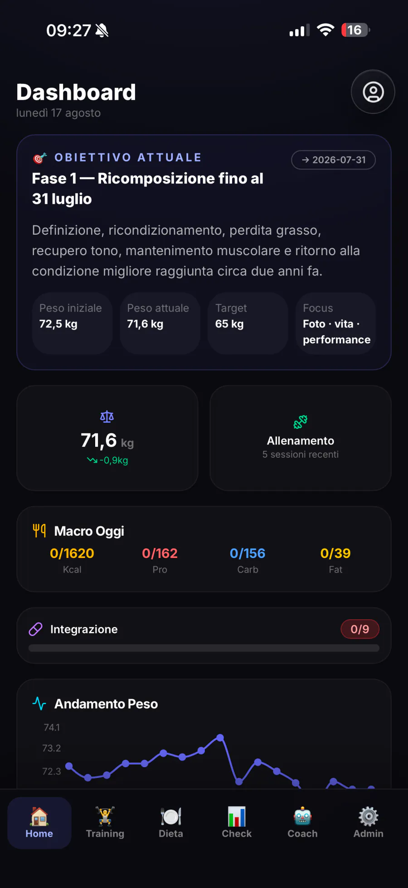
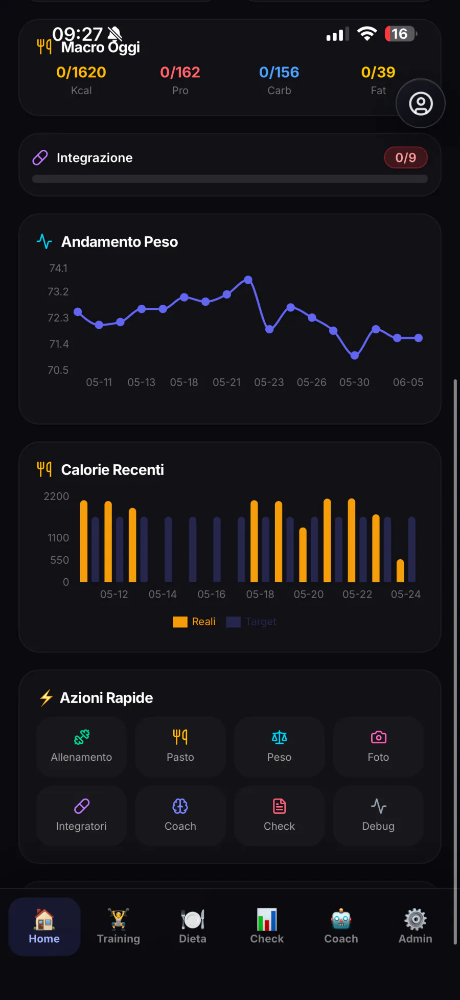
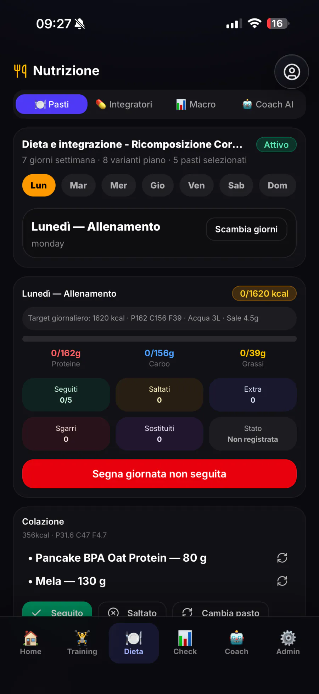

# Athleta — an AI fitness product where the agent proposes and you decide

> A personal web app for training, nutrition and progress tracking, with an AI coach grounded in
> the application's own context, a per-user memory and a dedicated knowledge base. Nothing the
> agent suggests is applied until the user confirms it.

**Role**
Full-stack architecture · Database modelling · Mobile-first UI · AI integration · Data validation · Deployment · RAG / LLM Wiki

**Type**
Personal product

---

## The problem

AI fitness apps have a trust problem that has nothing to do with model quality. They either give
generic advice that ignores everything the user has actually logged, or they quietly rewrite the
plan and leave the user unsure what changed or why.

Both failures come from the same root: the model has no durable, structured memory of this
specific person, and no explicit moment where the user agrees to a change.

## What I built

An app where every user owns a knowledge graph of themselves — profile, goals, rules, baseline,
photo analysis and training weeks — that the agent queries before it says anything. And a hard
rule in the write path: **the agent proposes, the user confirms, only then is anything applied.**

## Key capabilities

- **Mobile-first PWA** — home, training, diet, check-in, AI coach and an admin area, installable
  on the phone it is actually used on.
- **Active goal** — phase, starting weight, current weight and target, with the weight trend and
  actual calories against target over time.
- **Weekly nutrition plan** — daily macros and meals marked as followed, skipped or swapped, plus
  tracked supplementation.
- **Check-in and health reports** — progress photos, measurements, and medical documents stored
  privately per user.
- **Per-user LLM Wiki** — the user's own history as a knowledge graph the agent can query,
  maintained as structured notes and a navigable graph.
- **Confirm-before-apply** — proposals are shown as proposals. Nothing is written until the user
  confirms.

## Architecture

## Engineering decisions

**Structured proposals.** The agent emits a proposal the application can render, diff and apply.
The UI shows what would change before it changes.

**One knowledge graph per user.** Retrieval is scoped to the individual by construction. On a
product holding body composition and health-adjacent data, isolation is structural.

**Application context first, retrieval second.** The agent reads the current goal, plan and recent
logs from the application before it retrieves anything. Retrieval fills in history; it does not
have to reconstruct present state that the database already knows exactly.

**Validation before persistence, always.** A confirmed proposal still goes through the same
validation as manual input. User confirmation authorises the change; it does not vouch for it.

**Mobile-first.** The app is used at the gym, on a phone, mid-set. Layout starts from that case.

## AI in the product

- **RAG over a per-user knowledge graph** — profile, goals, rules, baseline, photo analysis and
  training weeks.
- **LLM Wiki** — the user's history structured as navigable knowledge rather than a transcript,
  exported as notes the coach can query.
- **Grounded coaching** — answers and proposals built from that user's own data and current plan,
  with OpenAI as the primary model and Anthropic as fallback.
- **Perception** — speech-to-text, document OCR and photo analysis so a check-in is more than a
  form.
- **Human-in-the-loop by design** — no autonomous writes.

## Security and privacy

The data is personal and health-adjacent, so it is treated that way: row-level security and
per-user isolation at the data and retrieval layers, private object storage, validation on every
write path, no autonomous modification of user data, and no sharing of one user's context with
another. Provider keys live on the backend, not in the client. The screenshots published here
come from the portfolio's public presentation of the product.

## Stack

**Frontend**
React 19 · TypeScript · Vite · React Router · TanStack Query
React Hook Form · Zod · Radix UI · shadcn · Tailwind CSS 4 · Recharts

**Backend**
Supabase · Auth · Edge Functions (Deno)

**Database**
PostgreSQL · RLS

**Storage**
Supabase Storage

**AI & Agents**
AI Coach · Structured proposals · OpenAI · Anthropic

**RAG & Knowledge**
RAG · LLM Wiki · Knowledge graph · Obsidian

**Multimodal**
Speech-to-text · Whisper · Document OCR · Mistral OCR · Tesseract.js · Photo analysis

**Mobile / Delivery**
PWA · Service worker · Vercel

**Tooling**
ESLint

## Result

The product is in personal use. The RAG and LLM Wiki patterns in my professional work were
designed and tested here against a real dataset.

## Source code

The source code is maintained in a private repository. This repository documents the
architecture, the AI design and the product decisions.

## Links

- **Interactive case study** — [francescoiaforte.vercel.app/en/projects/athleta](https://francescoiaforte.vercel.app/en/projects/athleta)
- **Profile** — [github.com/francescoveryra-dot](https://github.com/francescoveryra-dot)
- **Full portfolio** — [francescoiaforte.vercel.app](https://francescoiaforte.vercel.app)
